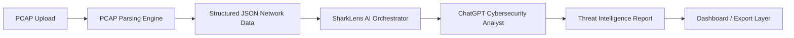
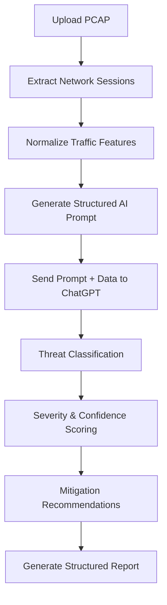
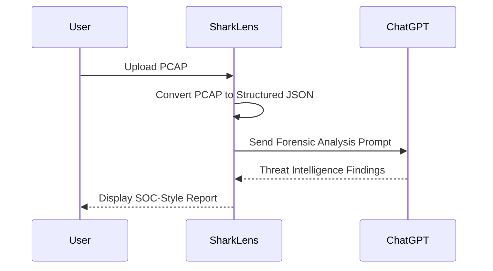

# 🦈 SharkLens  
### AI-Orchestrated Cybersecurity Intelligence from Wireshark Captures
**By:Vanya Sahi**
**Project Link**: https://sharklens.lovable.app/

<p align="center">


</p>

---

## 🌊 Overview

**SharkLens** is an AI-orchestrated cybersecurity intelligence platform that transforms Wireshark packet captures (PCAP files) into structured, explainable security insights.

Rather than directly analyzing packets itself, SharkLens acts as an intelligent orchestration layer that:

- 🧩 Converts raw PCAP files into structured network data
- 🧠 Generates structured forensic analysis prompts
- 🤖 Delegates deep cybersecurity reasoning to ChatGPT
- 📊 Produces professional, SOC-ready security reports
- 🛡️ Returns severity ratings, confidence scores, and mitigation steps

SharkLens bridges the gap between **packet-level traffic** and **actionable threat intelligence**.

---

# 🎯 Product Vision

Modern analysts face overwhelming packet-level noise in Wireshark.

SharkLens exists to:

- ⏱ Reduce manual packet inspection time
- 🔎 Accelerate anomaly detection workflows
- 🧠 Introduce AI-assisted forensic reasoning
- 📊 Provide structured and explainable threat assessments
- 🌐 Integrate into modern SOC and research environments

---

# 🏗️ System Architecture

SharkLens follows a clean **Orchestrate → Delegate → Report** design model.

It does not perform packet inspection logic internally — instead, it ensures structured and secure delegation to AI systems.

---

## 🔄 High-Level Architecture Flow



---

# 🧠 Intelligence Delegation Model

| Component | Responsibility |
|------------|----------------|
| 🦈 SharkLens | Prompt orchestration & workflow control |
| 🔍 Parser | Converts PCAP → structured JSON |
| 🤖 ChatGPT | Performs cybersecurity reasoning |
| 📊 Dashboard | Displays findings & recommendations |

This separation ensures:
- Transparent reasoning
- Modular design
- Scalability
- Reduced AI hallucination risk

---

# 🔍 Detailed Processing Pipeline



---

# 📦 Input Format

Raw packet captures are converted into structured JSON objects:

```json
{
  "timestamp": "2026-02-15T10:15:30Z",
  "src_ip": "192.168.1.10",
  "dst_ip": "10.0.0.8",
  "src_port": 44321,
  "dst_port": 22,
  "protocol": "TCP",
  "flags": ["SYN"],
  "packet_size": 60
}
```

### Why Structured Data?

- Improves AI reliability
- Reduces ambiguity
- Enables consistent classification
- Prevents raw binary transmission to AI

---

# 🛡️ AI Analysis Objectives

Each delegated prompt instructs ChatGPT to:

- 🔎 Detect anomalies in traffic patterns
- 🧨 Classify potential attack types  
  - Port Scanning  
  - DoS / DDoS  
  - Command & Control (C2)  
  - Data Exfiltration  
  - Malware Beaconing  
- 🎯 Identify Indicators of Compromise (IOCs)
- 📊 Assign Risk Levels (Low / Medium / High)
- 📈 Provide Confidence Scores
- 🧭 Recommend Follow-up Investigation Steps

---

# 🖥️ User Interaction Flow



---

# 📊 Example Output

## 🔎 Summary  
Suspicious TCP SYN burst activity detected, consistent with reconnaissance scanning behavior.

## 🚨 Risk Level  
High

## 🎯 Confidence  
87%

## 🧨 Indicators of Compromise
- Sequential port targeting
- Rapid SYN packet bursts
- Single source IP probing multiple hosts

## 🛠 Recommended Actions
- Block suspicious IP address
- Correlate with endpoint telemetry
- Review authentication logs for lateral movement
- Monitor for repeated beaconing intervals

---

# ⚙️ Core Technology Stack

- Wireshark / `tshark` for PCAP extraction
- Structured JSON normalization layer
- Lovable Cloud AI orchestration
- ChatGPT for cybersecurity reasoning
- Dashboard / reporting interface

---

# 🔐 Security Design Principles

- No raw PCAP binaries transmitted to AI
- Structured and minimal data exposure
- Optional IP redaction layer
- Designed for analyst review, not autonomous blocking
- Explainable AI outputs

---

# 🚀 Roadmap

- 🧠 Multi-step forensic reasoning chains
- 📈 Timeline reconstruction engine
- 🌍 Threat intelligence feed integration
- 🔁 Automated IOC enrichment
- 📊 Executive summary mode
- 🔌 REST API deployment support

---

# 📌 Use Cases

- Security Operations Centers (SOC)
- Cybersecurity research labs
- Academic threat analysis environments
- Incident response simulations
- AI-assisted network forensic workflows

---

# ⚠️ Disclaimer

SharkLens provides AI-assisted cybersecurity insights.

It does not replace:
- Enterprise IDS/IPS systems
- SIEM platforms
- Professional forensic investigators

Human review remains essential.

---

# 🌊 Why SharkLens?

Because network traffic is an ocean.

And sometimes you need more than Wireshark —

You need a lens.

---

## 📄 License

MIT License

---


